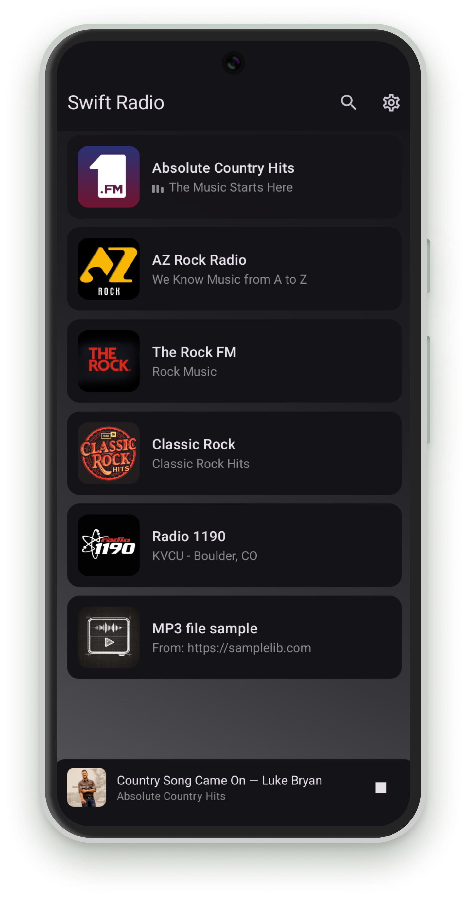
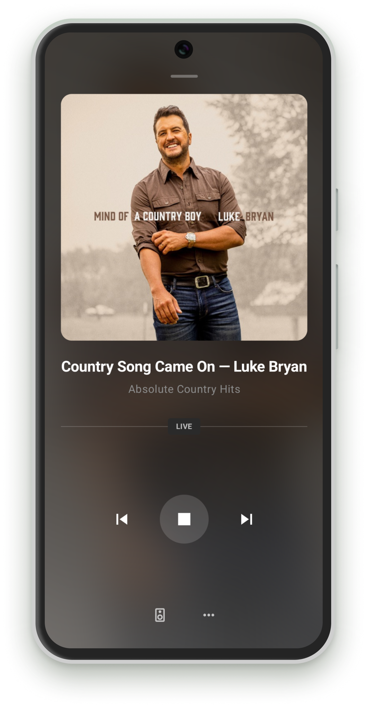

# Swift Radio Android

Open-source radio station app for Android built with Kotlin, Jetpack Compose, and Media3. Yes, it's called Swift Radio and it's written in Kotlin. The name comes from the [iOS original](https://github.com/analogcode/Swift-Radio-Pro). Same station JSON format, matching design and behavior.

<p align="center">
    
    
</p>

## Features

- Stream live and on-demand radio with background playback
- Android Auto integration with browse tree, playback controls, and artwork
- Album art and track metadata from streams and the iTunes API
- Lock screen and notification controls with artwork
- Multiple stations from a local or remote JSON file
- Search and filter stations by name or description
- Material You dynamic color support on Android 12+
- Localization-ready with all strings extracted to resources

## Requirements

- Android 7.0+ (API 24)
- Android Studio

## Getting Started

1. Open the project in [Android Studio](https://developer.android.com/studio)
2. Edit `Config.kt` to set your stations URL, contact info, and feature flags
3. Replace the stations in `app/src/main/assets/stations.json` with your own
4. Build and run

### Station Format

Each station in `stations.json` supports the following fields:

```json
{
  "station": [
    {
      "name": "Station Name",
      "streamURL": "https://example.com/stream",
      "imageURL": "station-image",
      "desc": "Short description",
      "longDesc": "Detailed description shown in the station info sheet.",
      "website": "https://example.com"
    }
  ]
}
```

| Field | Required | Description |
|-------|----------|-------------|
| `name` | Yes | Station name displayed in the list and player |
| `streamURL` | Yes | Direct URL to the audio stream (MP3, AAC, etc.) |
| `imageURL` | Yes | Image filename in `assets/` (without extension) or a full URL |
| `desc` | Yes | Short subtitle shown below the station name |
| `longDesc` | No | Longer description shown in the station info sheet |
| `website` | No | Station website URL shown in the info sheet |

Images can be local (asset name without `http`) or remote (full URL).

### Configuration

All app-wide settings live in `Config.kt`:

```kotlin
object Config {
    val gradientColor: Color = Color.White       // diagonal gradient overlay color
    const val useLocalStations = true             // false = fetch from stationsURL
    const val stationsURL = "https://..."         // remote stations JSON URL
    const val hideNextPreviousButtons = false      // hide skip controls on the player
    const val enableSearch = true                  // show/hide search bar on station list
    const val email = "contact@example.com"
    const val feedbackURL = "https://..."
    const val shareText = "Check out Swift Radio!"
}
```

### Customizing Text and Translation

All user-facing strings are in `app/src/main/res/values/strings.xml`. To add a new language:

1. Create a new directory: `app/src/main/res/values-XX/` (e.g., `values-fr` for French)
2. Copy `strings.xml` into the new directory
3. Translate the string values

Android will automatically use the correct language based on the user's device settings.

## Dependencies

| Library | Purpose |
|---------|---------|
| [AndroidX Media3](https://developer.android.com/media/media3) | Audio playback, media session, Android Auto |
| [Jetpack Compose](https://developer.android.com/compose) | UI framework with Material 3 |
| [Coil](https://github.com/coil-kt/coil) | Image loading and caching |
| [Ktor](https://github.com/ktorio/ktor) | HTTP client for remote station loading |
| [Kotlinx Serialization](https://github.com/Kotlin/kotlinx.serialization) | JSON parsing |

## Single Station Version

A single-station version is coming soon. It will be bundled with the [iOS single-station version](https://payhip.com/b/x15QB) for the same price. Updates will be posted here when it's ready.

For custom work or more advanced needs, reach out to [Fethi](mailto:contact@fethica.com).

**Built something with Swift Radio?** Drop us a line at [contact@fethica.com](mailto:contact@fethica.com).

## Credits

- [Fethi](https://fethica.com)
- Based on [Swift Radio Pro](https://github.com/analogcode/Swift-Radio-Pro) for iOS

## License

Swift Radio is open source and available under the [MIT License](LICENSE).
